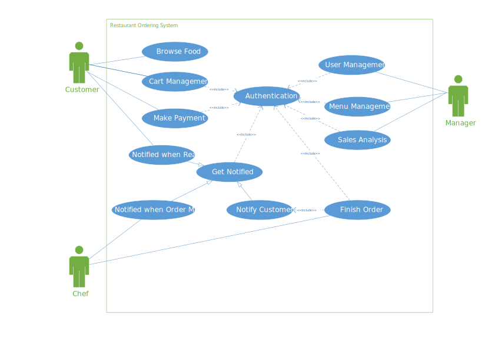
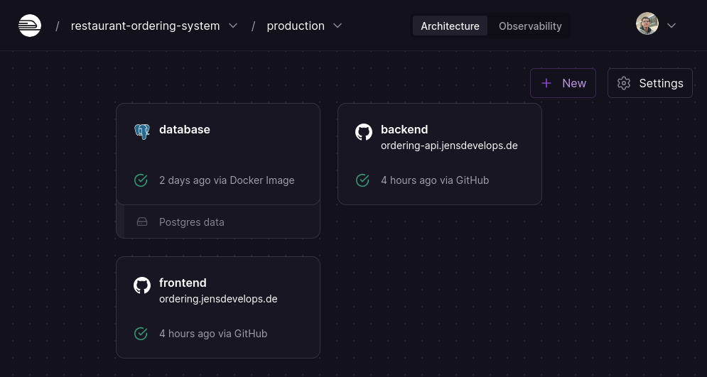
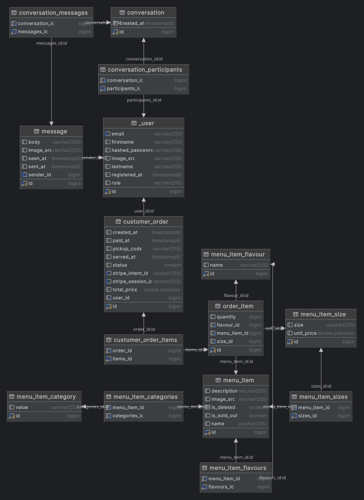

# Restaurant Ordering System Backend

💡 **Overview**

**front-end repo**
[https://github.com/JensLiu/restaurant-ordering-system-frontend](https://github.com/JensLiu/restaurant-ordering-system-frontend)

**back-end repo**
[https://github.com/JensLiu/restaurant-ordering-system-backend](https://github.com/JensLiu/restaurant-ordering-system-backend)

**Project demo**
[https://ordering.jensdevelops.de](https://ordering.jensdevelops.de)

⚠️ Do **NOT** enter your payment information, instead use the test card provided in the documentation </br>
TL;DR: Card No. 4242 4242 4242 4242 [Document: Test payment methods](https://stripe.com/docs/testing)

👤 Accounts

- `customer@jensdevelops.de`
- `chef@jensdevelops.de`
- `manager@jensdevelops.de`

Password: `password`

**Use case**



**CD/CI: Railway Architecture**



# Backend Tech Stack

| Tech                        | Used in                              |
|-----------------------------|--------------------------------------|
| Spring MVC                  | Controllers                          |
| Spring Security + JWT       | Authentication                       |
| Spring Data JPA + Hibernate | Database access and analysis queries |
| Stripe                      | Payment                              |
| Jakarta Web Socket          | Notification                         |

# Features

## **Authentication**

*Authenticate user on every API request*

Upon each request, a JWT access token must be attached either as an HTTP-only cookie or an Authentication header. Only
users with the correct identity can access the endpoints within its role.

When signed in, the user will be given an access token and a refresh token. When the access token expires, the user can
use the refresh token to refresh it since the refresh token lasts longer. It is implemented in the front end to
automatically refresh when receiving responses with the unauthorised status code.

## Profile management

Each user can modify their name, avatar, and password.

## **Menu item management**

Managers can

- Add/Edit/Remove categories
- Add/Edit/Remove menu items

Each menu item has the following attributes:

- id
- name
- description
- image source
- sold out flag
- delete flag
- flavour list
- category list
- <size, price> pair list

Menu items can only be deleted if no orders have been made using them, or they will be flagged as deleted but remain in
the database (archived)

Its flavour or <size, price> pair can only be deleted when no related order has been made. Once saved, it cannot be
altered. (You can delete and add a new pair to achieve this)

## **Stripe payment integration**

- Upon checkout, the backend will calculate the total price, then call the stripe API to make a payment intent and send
  the redirect URL as a response. The front end will be able to redirect to the stripe payment page.
- Upon successful payment, it will automatically update the payment status and call the notification service to notify
  chefs of an incoming order.

## **Order Analysis**

### Peak hour analysis

It calculates hourly transactional volume for each hour.

### Trending category analysis

It calculates the best-selling categories

### Trending item analysis

It calculates the best-selling items

### Valuable customer analysis

It ranks customers by the total amount spent in the store

## Realtime notification

It uses Web Socket to notify users connected to the server. Chefs are notified when an order is placed. Customers are
notified when an order is being prepared or finished.

# Global Error Handling and Response Enveloping

## Errors

**Errors are divided into three categories: `AuthExceptions`, `BusinessExceptions` and `InfrastructureExceptions`.**

- `AuthExceptions` are thrown when the accessing user does not have the correct role
- `BusinessExceptions` are thrown when business logic is violated
- `InfrastructureExceptions` are thrown when there’s an internal error

## Response Envelope

All responses are packed into the following format

```json
{
  "data": {
    "field": "value"
  },
  "message": "success/failed"
}
```

# Database design



⚠️ Note: conversation/chat feature is not implemented

# Deployment

Configure the following environment variables or rewrite the `application-prod.yaml`

```yaml
spring:
  datasource:
    username: ${PROD_DB_USER}
    password: ${PROD_DB_PASSWORD}
    url: jdbc:${PROD_DB_URL}
    driver-class-name: ${PROD_DB_DRIVER_NAME}
  jpa:
    properties:
      hibernate:
        use_sql_comments: true
        format_sql: true
        jdbc:
          lob:
            non_contextual_creation: true
    hibernate:
      ddl-auto: update
    database-platform: ${PROD_DB_DIALECT_CLASS}

app:
  jwt:
    secret: ${PROD_JWT_SECRET}
    access-token:
      cookie-name: ${PROD_JWT_ACCESS_TOKEN_COOKIE_NAME}
      expiration-ms: ${PROD_JWT_ACCESS_TOKEN_EXPIRATION_MS}
    refresh-token:
      cookie-name: ${PROD_JWT_REFRESH_TOKEN_COOKIE_NAME}
      expiration-ms: ${PROD_JWT_REFRESH_TOKEN_EXPIRATION_MS}
  stripe:
    api: ${PROD_STRIPE_API}
    webhook:
      secret: ${PROD_STRIPE_WEBHOOK_SECRET}
```

# References

- Stripe integration
    - [Documentation](https://stripe.com/docs)
    - [Fulfill orders with Checkout](https://stripe.com/docs/payments/checkout/fulfill-orders)
    - [Live Coding #1: Stripe payment integration - By @MarcoCodes](https://www.youtube.com/watch?v=BIDNKRluql4&t=1781s&pp=ygUSc3RyaXBlIHNwcmluZyBib290&ab_channel=MarcoBehler)
- Spring Security and JWT
    - [Spring Boot and Spring Security with JWT including Access and Refresh Tokens 🔑](https://www.youtube.com/watch?v=VVn9OG9nfH0&t=4240s&ab_channel=Amigoscode)
    - [Spring Boot CORS filter - CORS preflight channel did not succeed](https://stackoverflow.com/questions/36809528/spring-boot-cors-filter-cors-preflight-channel-did-not-succeed)
    - [What is the purpose of AuthenticationEntryPoint in Spring Web Security?](https://stackoverflow.com/questions/57426668/what-is-the-purpose-of-authenticationentrypoint-in-spring-web-security)
- Hibernate Query
    - [Chapter 15. HQL: The Hibernate Query Language](https://docs.jboss.org/hibernate/core/3.5/reference/en/html/queryhql.html#queryhql-identifier-property)
- Web Socket
    - [Spring websocket EOFException](https://stackoverflow.com/questions/46888759/spring-websocket-eofexception)