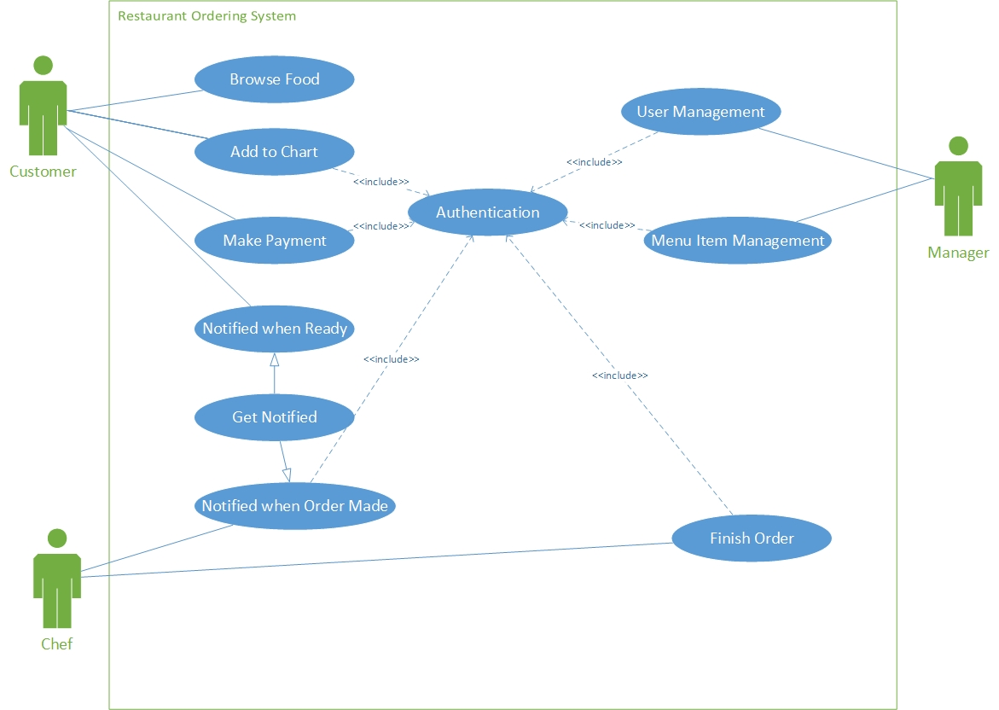
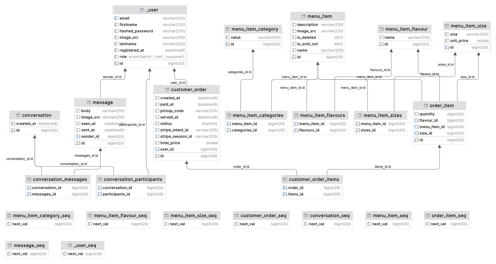

# Backend

# Backend Tech Stack

| Tech | Used in |
| --- | --- |
| Spring MVC | Controllers |
| Spring Security + JWT | Authentication |
| Spring Data JPA + Hibernate | Database access and analysis queries |
| Stripe | Payment |
| Jakarta Web Socket | Notification |

# Features

The use-case diagram of this project is as follows:



## **Authentication**

*Authenticate user on every api request*

Upon each request, a JWT access token should be attached either as a HTTP-only cookie or Authentication header. Only users with correct identity can access the endpoints within its role.

When signed in, user will be given an access token and refresh token. When access token expires, you can use refresh token to refresh it since refresh token lasts longer. It is implemented in the frontend to automatically refresh when receiving response with unauthorised status code.

## Profile management

Each user can modify their name, avatar and password.

## **Menu item management**

Managers can

- Add/Edit/Remove categories
- Add/Edit/Remove menu items

Each menu item has the following attributes:

- id
- name
- description
- image source
- sold out flag
- delete flag
- flavour list
- category list
- <size, price> pair list

Menu items can only be deleted if no orders have been made using them, or they will be flagged as deleted but still remain in the database (archived)

Its flavour or <size, price> pair can only be deleted only when no order related has been made. Once saved, the it cannot be altered. (You can delete and add a new pair to achieve this)

## **Stripe payment integration**

Upon checkout, the backend will calculate the total price and call the stripe API to make a payment intent and send the redirect URL as response. The frontend will be able to redirect page to the stripe payment page.

Upon payment finished, it will automatically update the payment status and call the notification service to notify chefs of an incoming order.

## **Order Analysis**

### Peak hour analysis

It calculates hourly transactional volume for each hour.

### Trending category analysis

It calculates the best-selling categories

### Trending item analysis

It calculates the best-selling items

### Valuable customer analysis

It ranks customers by the total amount spent in the store

## Realtime notification

It uses Web Socket to notify users connected to the server. Chefs are notified when an order is places. Customers are notified when an order is being prepared and an order is finished.

# Global Error Handling and Response Enveloping

## Errors

**Errors are divided into three categories: `AuthExceptions`, `BusinessExceptions` and `InfrastructureExceptions`.**

`AuthExceptions` are thrown when accesssing user does not have the correct role

`BusinessExceptions` are thrown when business logic is violated

`InfrastructureExceptions` are thrown when there’s an internal error

## Response Envelope

All responses are packed into the following format

```json
{
	"data": { ...data },
	"message": "success" | "failed"
}
```

# Database design



# Deployment

Configure the following environment variables or rewrite the `application-prod.yaml`

```yaml
spring:
  datasource:
    username: ${PROD_DB_USER}
    password: ${PROD_DB_PASSWORD}
    url: jdbc:postgresql://${PROD_DB_HOST}:${PROD_DB_PORT}/${PROD_DB_NAME}
    driver-class-name: org.postgresql.Driver
  jpa:
    properties:
      hibernate:
        use_sql_comments: true
        format_sql: true
        jdbc:
          lob:
            non_contextual_creation: true # for postgresql
    hibernate:
      ddl-auto: update

app:
  jwt:
    secret: ${PROD_JWT_SECRET}
    access-token:
      cookie-name: ${PROD_JWT_ACCESS_TOKEN_COOKIE_NAME}
      expiration-ms: ${PROD_JWT_ACCESS_TOKEN_EXPIRATION_MS}
    refresh-token:
        cookie-name: ${PROD_JWT_REFRESH_TOKEN_COOKIE_NAME}
        expiration-ms: ${PROD_JWT_REFRESH_TOKEN_EXPIRATION_MS}
  stripe:
    api: ${PROD_STRIPE_API}
    webhook:
        secret: ${PROD_STRIPE_WEBHOOK_SECRET}
```

# References

- Stripe integration
    
    [Documentation](https://stripe.com/docs)
    
    [Fulfill orders with Checkout](https://stripe.com/docs/payments/checkout/fulfill-orders)
    
    [Live Coding #1: Stripe payment integration - By @MarcoCodes](https://www.youtube.com/watch?v=BIDNKRluql4&t=1781s&pp=ygUSc3RyaXBlIHNwcmluZyBib290&ab_channel=MarcoBehler)
    
- Spring Security and JWT
    
    [Spring Boot and Spring Security with JWT including Access and Refresh Tokens 🔑](https://www.youtube.com/watch?v=VVn9OG9nfH0&t=4240s&ab_channel=Amigoscode)
    
    [Spring Boot CORS filter - CORS preflight channel did not succeed](https://stackoverflow.com/questions/36809528/spring-boot-cors-filter-cors-preflight-channel-did-not-succeed)
    
    [What is the purpose of AuthenticationEntryPoint in Spring Web Security?](https://stackoverflow.com/questions/57426668/what-is-the-purpose-of-authenticationentrypoint-in-spring-web-security)
    
- Hibernate Query
    
    [Chapter 15. HQL: The Hibernate Query Language](https://docs.jboss.org/hibernate/core/3.5/reference/en/html/queryhql.html#queryhql-identifier-property)
    
- Web Socket
    
    [Spring websocket EOFException](https://stackoverflow.com/questions/46888759/spring-websocket-eofexception)